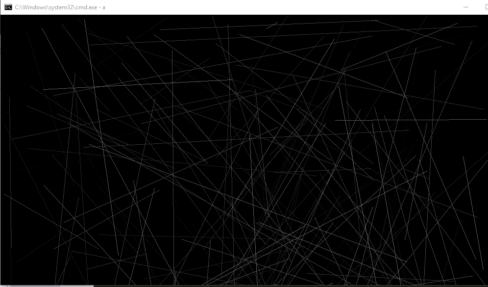
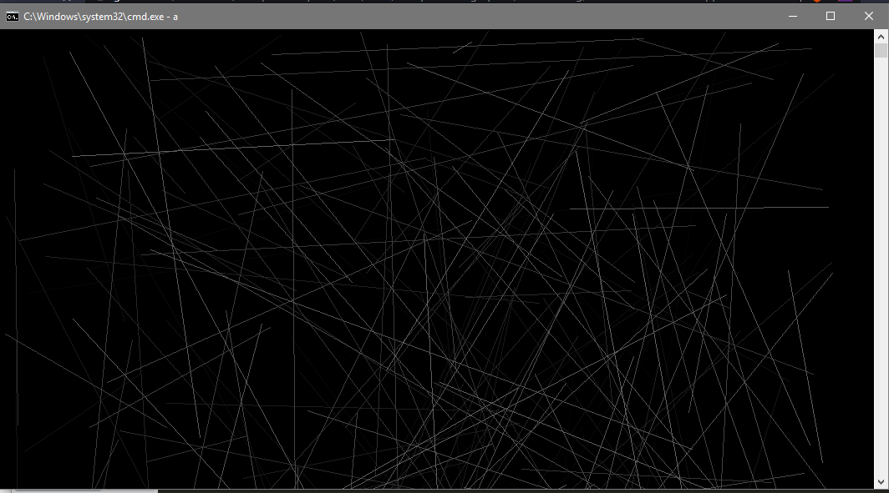
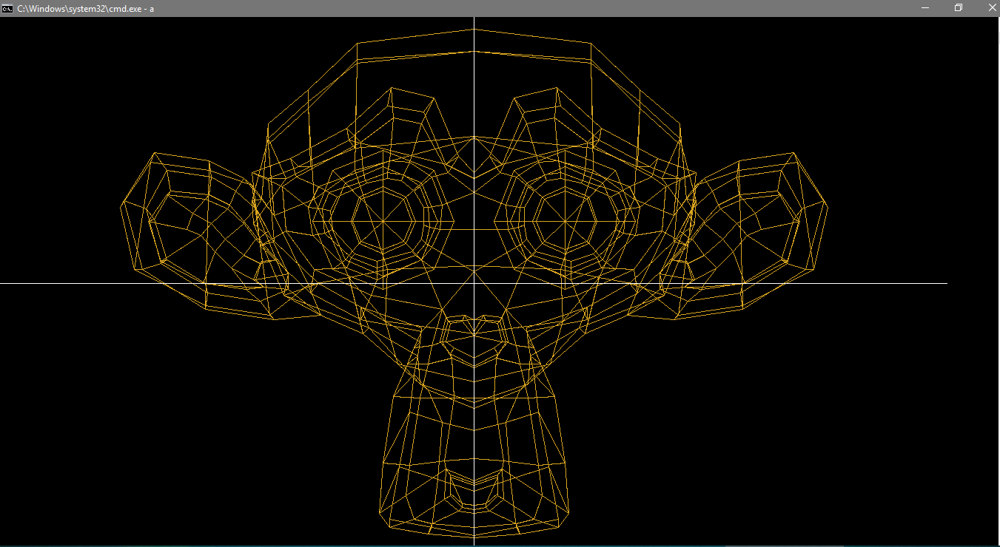
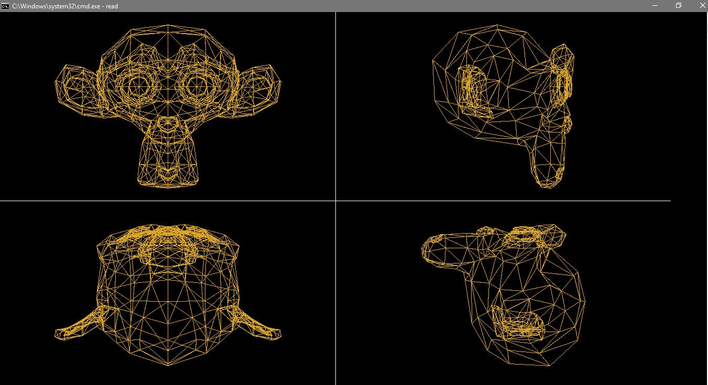
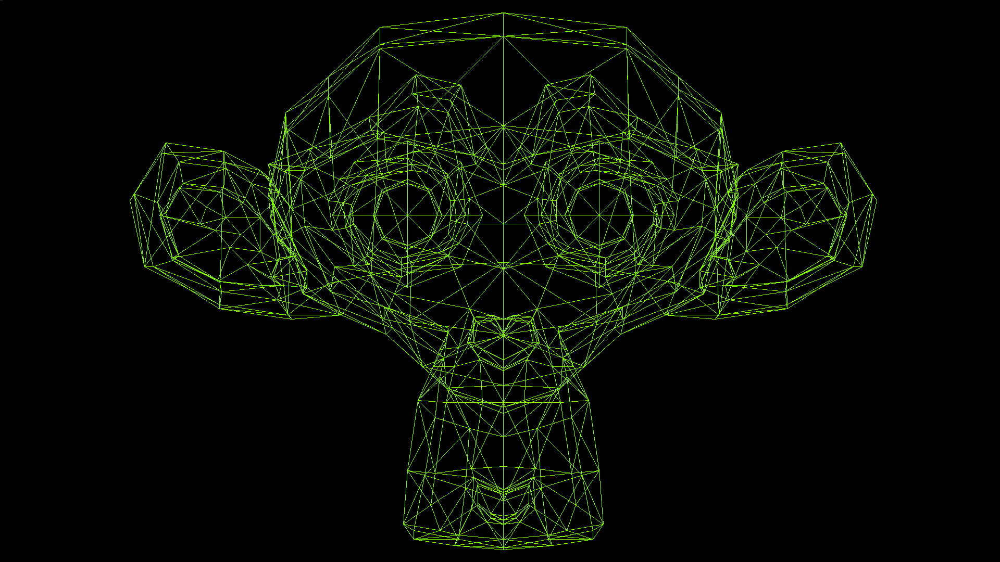
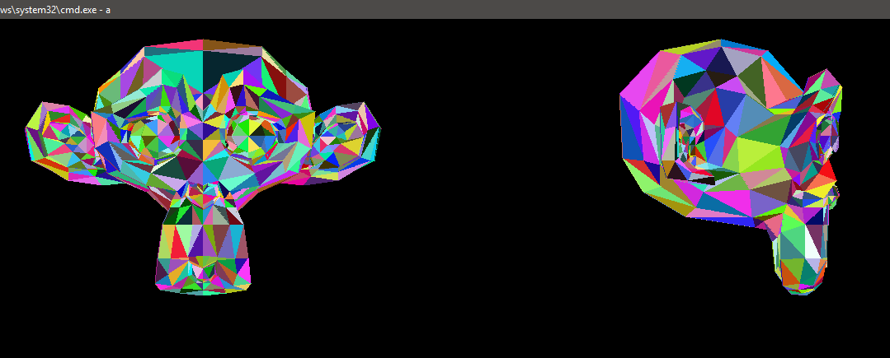
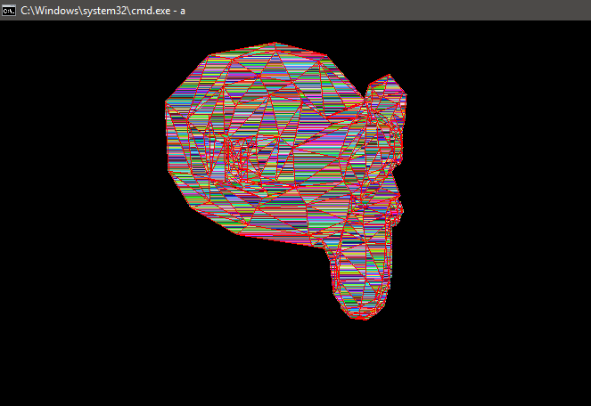

# ComputerGraphics

Repository for the practices in Computer Graphics in ESCOM 2020.

Professor: Rafael Norman Saucedo Delgado.
Student: Laura Andrea Morales López

Is made for Windows system.

## Bresenham Line Drawing
For [Bresenham Line Drawing](https://github.com/Lalaandrea/ComputerGraphics/blob/main/Computer%20graphics/LineDrawing/BresenhamDrawLines.cpp) compile as.

```bash
g++ BresenhamDrawLines.cpp -o Bresenham -lgdi32
```


## DDA Line Drawing
For [DDA Line Drawing](https://github.com/Lalaandrea/ComputerGraphics/blob/main/Computer%20graphics/LineDrawing/DDALineDrawing.cpp) compile as.
```bash
g++ DDALineDrawing.cpp -o DDA -lgdi32
```


## Reading Obj, and make transformations
For [Reading Obj, and make transformations](https://github.com/Lalaandrea/ComputerGraphics/blob/main/Computer%20graphics/ObjAndTransformations/ObjTransformations.cpp) compile as.
```bash
g++ ObjTransformations.cpp -o ObjTrans -lgdi32
```


## Obj to VLF
For [Obj to VLF](https://github.com/Lalaandrea/ComputerGraphics/blob/main/Computer%20graphics/VLF/ObjToVLF.cpp) compile as.
```bash
g++ ObjToVLF.cpp -o ObjToVLF
```
Get [VLF File](https://github.com/Lalaandrea/ComputerGraphics/blob/main/Computer%20graphics/VLF/mono.vlf)

## Reading VLF also perspective projection
For [Reading VLF](https://github.com/Lalaandrea/ComputerGraphics/blob/main/Computer%20graphics/VLF/VLFRead.cpp) compile as.
```bash
g++ VLFRead.cpp -o ReadVLF -lgdi32
```


## Animation

Video created with [Reading Obj, and make transformations](https://github.com/Lalaandrea/ComputerGraphics/blob/main/Computer%20graphics/ObjAndTransformations/ObjTransformations.cpp) 



## Scanline, Zbuffer and VLF Oriented

For [Create VLF Oriented](https://github.com/Lalaandrea/ComputerGraphics/blob/main/Computer%20graphics/ZBuffer/CreateVLFOriented.cpp) compile as.
```bash
g++ CreateVLFOriented.cpp -o VLFOriented
```
Get [VLF File](https://github.com/Lalaandrea/ComputerGraphics/blob/main/Computer%20graphics/ZBuffer/Omono.vlf)

For [Reading VLF Oriented, ZBuffer and Scanline](https://github.com/Lalaandrea/ComputerGraphics/blob/main/Computer%20graphics/ZBuffer/VLFOrientedRead.cpp)

```bash
g++ VLFOrientedRead.cpp -o Read -lgdi32 
```


##### Scanline Only

